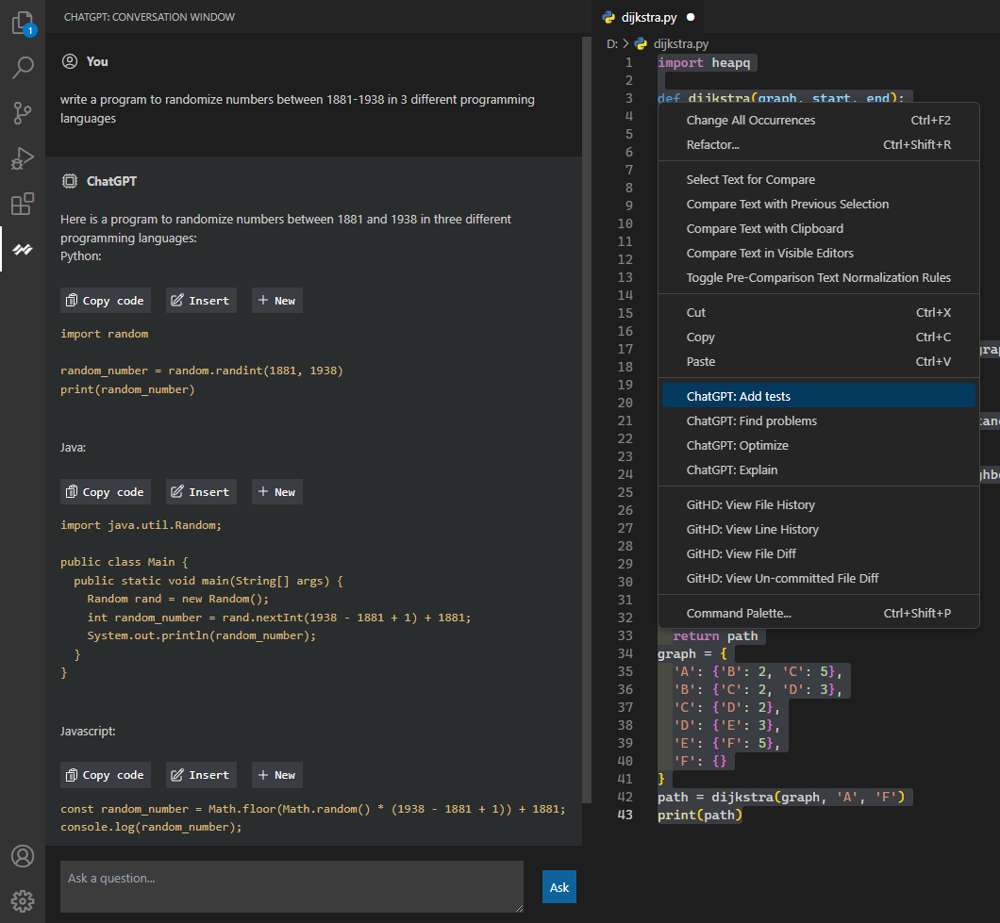
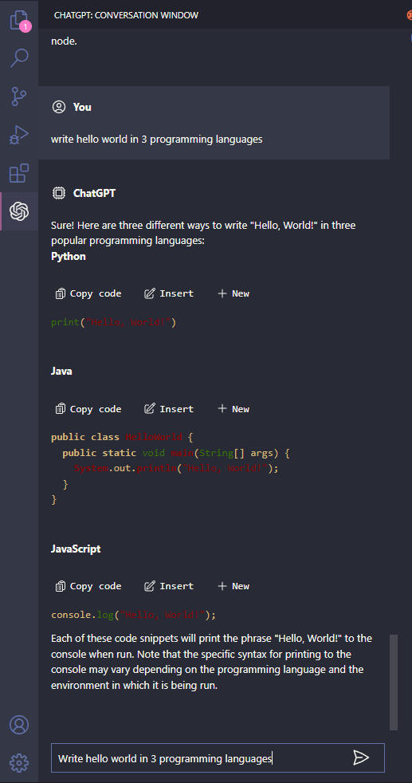
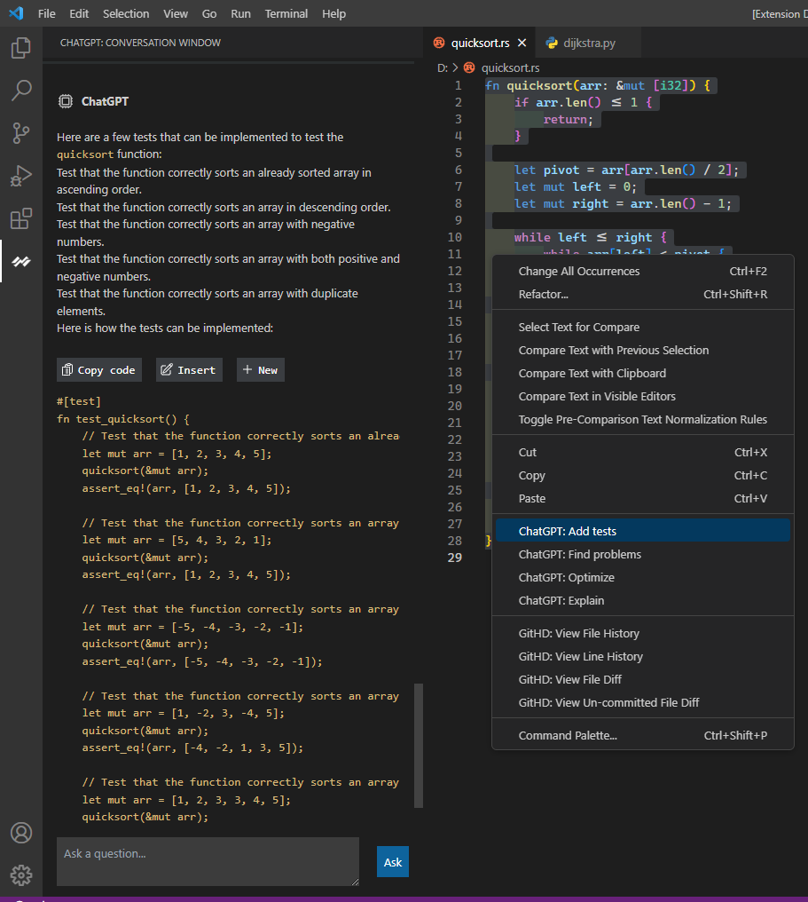
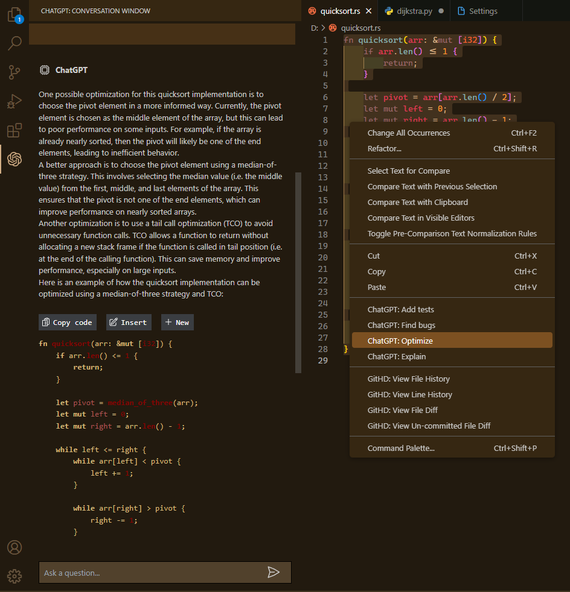
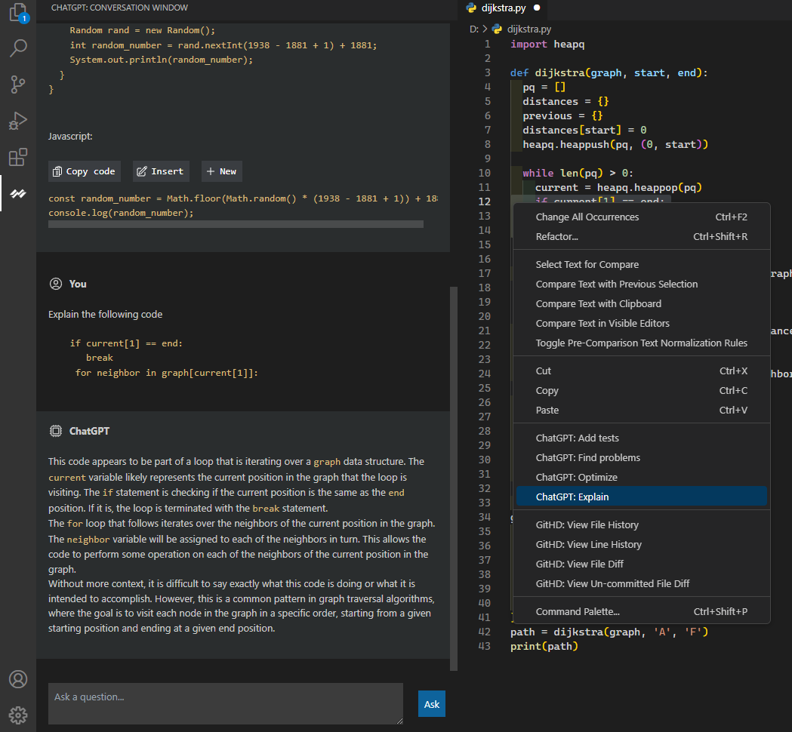
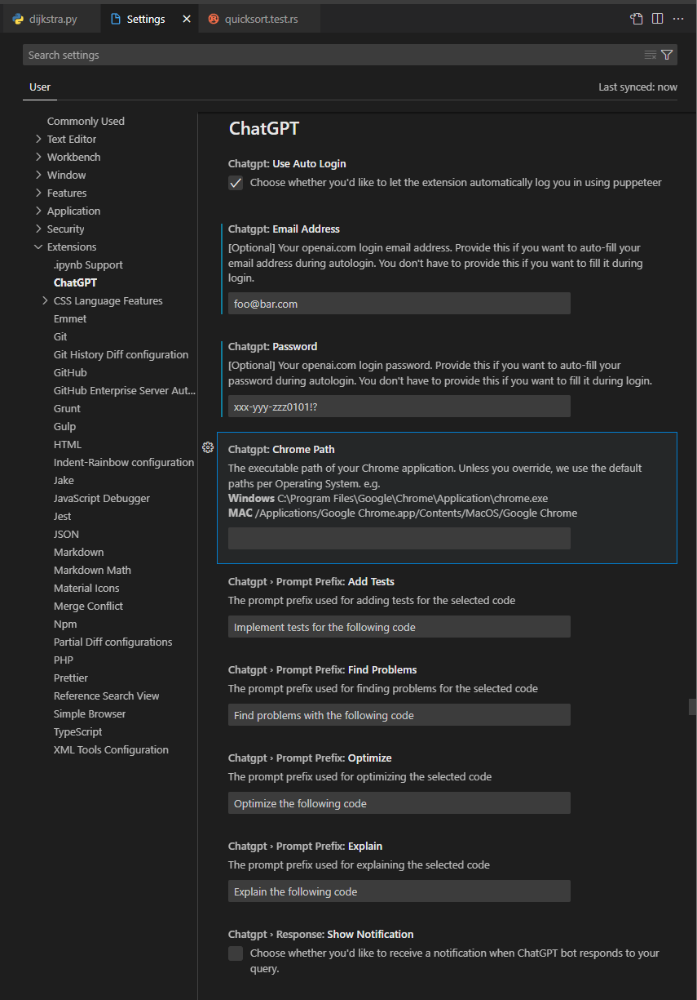

<h2 align="center"> Ask ChatGPT</h2>

<strong>ChatGPT conversations in Visual Studio Code</strong>

---

# Setup

Login following the instructions here to get your access token: https://github.com/transitive-bullshit/chatgpt-api#how-it-works

# Features

The extension comes with context menu commands, conversation window and customization options for OpenAI's ChatGPT prompts.

## ChatGPT conversation window in vs-code

Ask free-form text questions that will be listed in the conversation window. The conversation is kept in cache until vs-code instance is closed.

---

## Add tests for your code

Right click on a selected block of code, run `ChatGPT: Add Tests` command for ChatGPT to write tests for you.

## Find problems in your code

Right click on a selected block of code, run `ChatGPT: Find problems` command for ChatGPT to analyze and find problems in your code.

## Improve & optimize your code

Right click on a selected block of code, run `ChatGPT: Optimize` command for ChatGPT to add suggestions to your code to improve.

## Explain your code

Right click on a selected block of code, run `ChatGPT: Explain` command for ChatGPT to explain the selected code.

# Settings

- You can configure the commands to use any prompts for the selected code.

# Troubleshooting

If the bot isn't responding, try clearing your cache by running the `ChatGPT: Clear session` command.

# Contributions

- Open AI ChatGPT: https://chat.openai.com/
- ChatGPT API: https://github.com/transitive-bullshit/chatgpt-api
